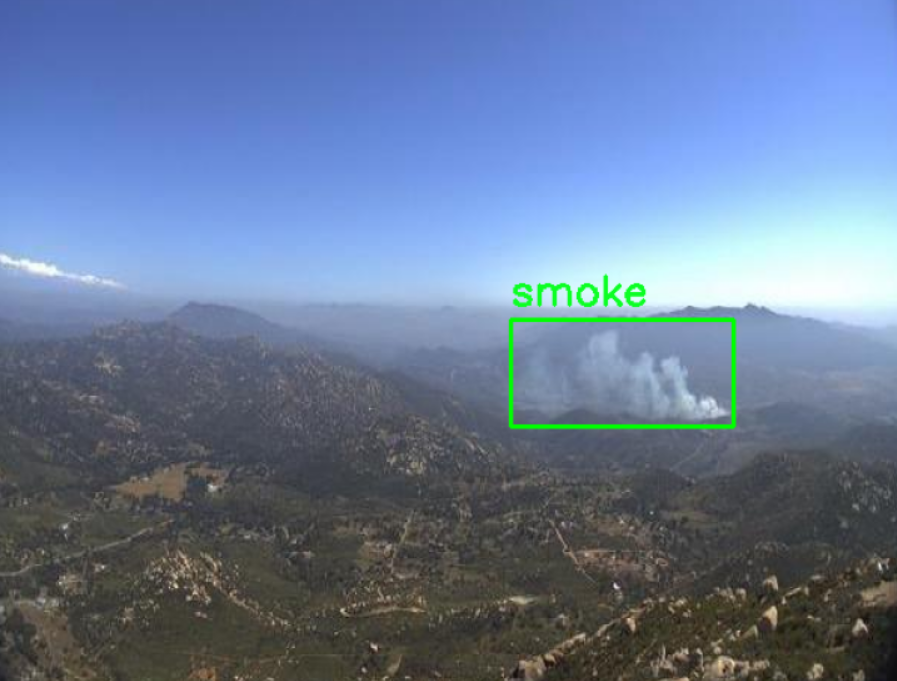

## Fire and Smoke Detection

### Description

This project is focused on building a reliable fire and smoke detection system using machine learning techniques. The goal is to detect fire and smoke in images or video streams to enable early warnings and prevent severe damage.

Key Files

- fire_smoke_detection.ipynb: Main Jupyter Notebook for implementing and evaluating the detection pipeline.

- requirements.txt: Dependencies required for the project.